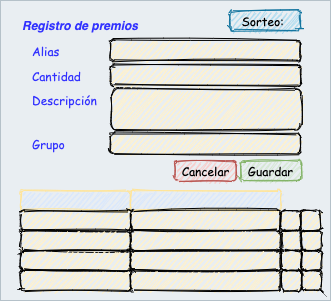

# Administrador de sorteos

Proyecto realizado en conjunto con [FTC](http://www.ftc.com) e impulsado por [Biotecsa](http://biotecsa.com) para continuar con la tradición de entrega de presentes al equipo que conforma la empresa en agradecimiento al esfuerzo dado durante un año duro de trabajo. Este trabajo surge por la necesidad y compromiso de quedarse en casa durante estos tiempos de Pandemia. 

La aplicación consta de una página que permite llevar a cabo el registro de sorteos, grupos/organización de participantes, participantes y premios. Acceso al panel de control donde se ven los detalles del sorteo que está ocurriendo y la apertura y cierre del sorteo.

## Inicio.

Para acceder al administrador, es necesario contar con la cuenta (correo electrónico) del que se ha designado como administrador y la contraseña que se le ha entregado. 

Solamente se tendrá un usuario administrador y su configuración es manual. Por tanto, en caso de pérdida de las credenciales de acceso, se tendrán que solicitar nuevamente al responsable de la aplicación.

Una vez que se haya accedido, aparecerá el panel de administración con las siguientes opciones de menú.Cada una de las pantallas vinculadas a las opciones de menú son las que se describen en adelante.

## Manejo de sorteos.

Permite crear, modificar, eliminar y listar los sorteos. Se debe de indicar un nombre al sorteo y la fecha en que se llevará a cabo, aunque este valor solo sirve de referencia, ya que no se inicia de forma automática el evento.

### Consideraciones.

- Solo es posible modificar y eliminar sorteos que no hayan sido iniciados. 
- No es posible crear dos sorteos con el mismo nombre, o con la misma fecha.
- Una vez cerrado un sorteo, no es posible volver a abrirlo.
- Los detalles del sorteo se pueden consultar en cualquier momento
- El nombre del sorteo no puede contener más de 100 caracteres

El botón de “Agregar Participantes”, te lleva a la pantalla de registro de participantes y te permite seleccionar un registro de Sorteo para asociarlos a este. De esta forma se estarían asociando los participantes a un sorteo en particular. Lo mismo sucede con el botón de “Agregar Premios”, que te dirige a la pantalla de mantenimiento de premios asociados a un Sorteo. 

El listado de Sorteos contiene los registros realizados y permite, modificar o eliminar en caso de que aún su estado sea de “Pendiente”, en caso de que se encuentren en publicación o bien ya se hayan cerrado, no se pueden tomar estas acciones. 

Mientras el sorteo esté en estado “Activo”, se podrán consultar los detalles del Sorteo, que nos dirige hacia la ventana:

Esta pantalla nos muestra el estado del evento, los premios que se han otorgado y los que aún quedan pendientes. Finalmente se muestra el listado del resultado del sorteo, donde se ven los participantes y su premio seleccionado. 

El botón de “Cerrar Sorteo”, permite al administrador cerrar el sorteo. En caso de que aún no estén seleccionados todos los premios por parte de los participantes, se mandará un mensaje para confirmar el cierre, ya que una vez cerrado no se podrá volver a abrir. En caso de que no haga falta la selección de premios, esta alerta se omite y se ejecuta el cierre del evento. En caso de que el Sorte tenga un estado de “Cerrado”, este botón no se presentará.

## Registro de Grupos.

El registro de grupos se realiza con el fin de catalogar a los participantes en diferentes grupos y asociarlos a un grupo de premios. De esta manera se generan sorteos por grupo. 

### Consideraciones.

- Especificar un nombre no mayor a cincuenta caracteres y usar solo caracteres alfanuméricos. 
- La descripción se sugiere que sea breve, no es necesario rellenar el campo.
- Los nombres deben de ser únicos, no se permiten duplicados.
- Los grupos no están asociados a sorteos, se pueden usar en cualquier sorteo.

En la pantalla se muestra el listado de grupos con los ya existentes y permite llevar a cabo la modificación en todo momento y la eliminación siempre y cuando no se encuentren en uso. 

## Registro de participantes.

La identificación y medio de comunicación con los participantes para el reclamo del premio, se realiza a través del correo electrónico, ya que se hace un envío automático una vez que el participante ha seleccionado su premio. 

### Consideraciones.

- El nombre del participante debe ser asociado al representante del correo electrónico, no puede contener más de ciento veinte caracteres.
- El correo electrónico debe ser un correo valido y debe pertenecer al dominio de Biotecsa, es decir que se valida que tenga el sufijo @biotecsa.com
- Se puede seleccionar un grupo del listado previamente registrado. No es un campo obligatorio.
- Se puede establecer el evento al que se le autoriza al participante. En caso de no ser especificado, se entiende que puede participar en cualquier evento.

Es posible llevar a cabo la selección del grupo al que pertenece el participante durante el sorteo. En caso de no marcarse ningún grupo, se considera que podrá acceder a cualquier de los grupos registrados para el sorteo, pudiendo seleccionar alguno de todos los premios incluidos en el sorteo.

De igual forma, se da la posibilidad de elegir un evento en particular al cual registrar al participante. Con esta opción se asegura que algún participante previamente registrado para un sorteo previo no pueda acceder a otro sorteo donde no ha sido invitado. 

Las invitaciones a participar en el sorteo se envían al momento de iniciar el evento del sorteo y se incluyen a los participantes que están incluidos en el sorteo y los que no tienen ningún sorteo asociado.  

## Registro de premios.

Los premios, al igual que los participantes, se pueden asociar a un sorteo en particular y se dirigen hacia un grupo. 

### Consideraciones.

- El Alias del premio, debe ser una forma simple de identificar el objeto. 
- En el campo de cantidad se puede especificar el número de premios a registrar de este tipo (Alias). 
- En caso de que no se incluya el grupo, se entenderá que el o los premios se pueden seleccionar por cualquier de los participantes, no importando su grupo.
- Si el premio no ha sido asociado a un sorteo, entonces podrá ser elegido en cualquier evento.
- La descripción debe contener el detalle del premio, puede incluir un máximo de dos mil caracteres. 
- En el listado de premios, es posible llevar a cabo las actividades de modificación y eliminación, solo en caso de que el premio no haya sido seleccionado. 
 

Los premios solo se pueden seleccionar una vez por parte de los participantes. Una vez concretada la operación de selección, se envía un correo de confirmación al administrador y el participante con el detalle del premio para su próxima reclamación.

En la pantalla del participante aparecerá un listado de premios por escoger y que no han sido previamente elegidos, por tanto son sujetos de selección. Cuando se haga la selección del premio, es posible que al mismo tiempo otro participante haya seleccionado el mismo elemento, en este caso se notificará un fallo indicando que alguien más ya ha seleccionado este premio. Se refrescará la pantalla mostrando los disponibles.

Los premios que no fueron seleccionados al cierre del evento, se marcarán como no disponibles. En caso de querer utilizar el registro para otro evento, será necesario editar el premio desde el listado de premios y asignar al sorteo en el que se requiere incluir. 

## El sorteo.

Una vez que el administrador haya publicado el sorteo, se mandará un correo electrónico a todos los participantes invitándolos a acceder, en el correo se enviará una clave de acceso única que les permitirá entrar al panel de selección de premios. 

En caso de que algún participante no pueda acceder correctamente con la información enviada por correo electrónico, se podrá notificar al administrador del evento a través del enlace de “Problema con el acceso”. En este momento se enviará un correo electrónico al administrador notificando el problema.

A los participantes que ya han seleccionado su premio, no se les permitirá acceder nuevamente. En caso de que traten de acceder al sorteo se les enviará un mensaje de error.

Una vez se encuentren en la pantalla de selección de premios. Se listaran los premios disponibles, el participante podrá llevar a cabo la selección de un premio y enviar la confirmación de selección. 

Sin embargo y con base a la dinámica, es posible que en el momento de la selección, alguien más haya seleccionado alguno y por tanto se notificará del error al momento del envío de la confirmación. El participante tendrá que actualizar el listado para ver los premios que aún se encuentran disponibles.

Al momento de confirmar la selección del premio, se enviará un correo electrónico al administrador del evento y al participante, notificando los detalles del premio. 

Una vez que el participante elige Salir, se dirigirá a la pantalla principal del sitio de [biotecsa](http://biotecsa.com).
